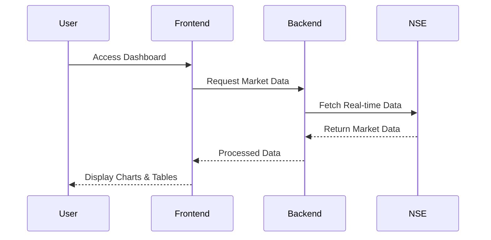

# 📈 Stock Market Trading Platform  

<div align="center">  
    
    
    
  <h3>🚀 Real-time Stock Market Data Analysis & Visualization Platform</h3>  
</div>  

---

## 📖 Table of Contents  

1. [✨ Features](#-features)  
2. [🔧 Tech Stack](#-tech-stack)  
3. [🌐 API Endpoints](#-api-endpoints)  
4. [🚀 Getting Started](#-getting-started)  
5. [📊 Data Flow](#-data-flow)  
6. [🔒 Security](#-security)  
7. [🎨 Theme Customization](#-theme-customization)  
8. [📱 Responsive Design](#-responsive-design)  

---

## ✨ Features  

- **🔄 Real-time NSE (National Stock Exchange) data streaming**  
- **📊 Interactive stock charts with ApexCharts**  
- **🎯 Advanced filtering and sorting capabilities**  
- **📱 Responsive design for all devices**  
- **🔍 Smart search functionality**  
- **📈 Market indices tracking (NIFTY 50, BANK NIFTY)**    
- **📉 Historical data analysis**  

---

## 🔧 Tech Stack  

- **Frontend:** React.js, ApexCharts  
- **Backend:** Node.js, Express  
- **Data Source:** NSE APIs  
- **Styling:** CSS with responsive design  
- **State Management:** React Hooks  
- **API Integration:** Axios  

---

## 🌐 API Endpoints  

| Endpoint            | Method | Description                          | Response                                      |  
|----------------------|--------|--------------------------------------|-----------------------------------------------|  
| `/api/nifty50`       | GET    | Get NIFTY 50 index data              | JSON with current index value, change %, constituents |  
| `/api/indices`       | GET    | Get all major market indices         | Array of index objects with real-time data    |  
| `/api/market-status` | GET    | Check market status                  | Market state, timing, and trading status      |  
| `/api/stock/:symbol` | GET    | Get real-time data for a specific stock | JSON with stock details, price, volume, etc. |  

---

## 🚀 Getting Started  

1. **Clone the repository**  
   ```bash  
   git clone https://github.com/mRcOol7/stock-data.git  
   cd trading  
   ```  

2. **Install dependencies**  
   ```bash  
   # Install frontend dependencies  
   npm install  
   # Install backend dependencies  
   cd server  
   npm install  
   ```  

3. **Set up environment variables**  
   ```bash  
   cp .env.example .env  
   # Edit .env with your configuration  
   ```  

4. **Start the development server**  
   ```bash  
   # Start the backend server  
   cd server  
   npm start  
   # Start the frontend application (in a new terminal)  
   # From the root directory  
   npm start  
   ```  

---

## 📊 Data Flow  



---

## 🔒 Security  

- **CORS protection**  
- **Rate limiting**  
- **Request validation**  
- **Error handling**  

---

## 🎨 Theme Customization  

The platform supports both light and dark themes with customizable colors:  

```css  
:root {  
  --primary-color: #2196f3;  
  --secondary-color: #f50057;  
  --background-light: #ffffff;  
  --background-dark: #121212;  
}  
```  

---

## 📱 Responsive Design  

- **Mobile-first approach**  
- **Breakpoints for all devices**  
- **Fluid typography**  
- **Flexible grid system**  
- **Touch-friendly navigation**  

---

## 🤝 Contributing  

1. **Fork the repository**  
2. **Create your feature branch**  
   ```bash  
   git checkout -b feature/AmazingFeature  
   ```  
3. **Commit your changes**  
   ```bash  
   git commit -m 'Add some AmazingFeature'  
   ```  
4. **Push to the branch**  
   ```bash  
   git push origin feature/AmazingFeature  
   ```  
5. **Open a Pull Request**  

---

<div align="center">  
  Made with ❤️ for traders and developers  
</div>
